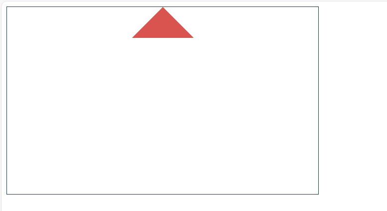

### 一、输出

###### 1.写出下列输出。

```js
async function async1() {
    console.log('async1 start')
    await async2()
    console.log('async1 end')
}
async function async2() {
    console.log('async2')
}
console.log('script start')
setTimeout(function () {
    console.log('settimeout')
})
async1()
new Promise(function (resolve) {
    console.log('promise1')
    resolve()
}).then(function () {
    console.log('promise2')
})
console.log('script end')
```

###### 2.写出下列输出。

```js
function fun(n, o) {
    console.log(o)
    return {
        fun(m) {
            return fun(m, n);
        }
    };
}

// 输出分别是什么？
var a = fun(0); a.fun(1); a.fun(2); a.fun(3);
var b = fun(0).fun(1).fun(2).fun(3);
var c = fun(0).fun(1); c.fun(2); c.fun(3);
```

tips：第一题是异步，第二题是闭包。

### 二、手撕

###### 1.简单手撕

```js
1.搭建Vue项目，实现简单加法器。（提示，简单的数据绑定）。

2.使用Vue-Router，切换路由到第二个页面，而且第二个页面实现以下页面：

tips：以上全部操作同步git。
```



###### 2.算法手撕

```js
给你一个整数数组 nums ，判断是否存在三元组 [nums[i], nums[j], nums[k]] 满足 i != j、i != k 且 j != k ，同时还满足 nums[i] + nums[j] + nums[k] == 0 。请

你返回所有和为 0 且不重复的三元组。

注意：答案中不可以包含重复的三元组。

示例 1：

输入：nums = [-1,0,1,2,-1,-4]
输出：[[-1,-1,2],[-1,0,1]]
解释：
nums[0] + nums[1] + nums[2] = (-1) + 0 + 1 = 0 。
nums[1] + nums[2] + nums[4] = 0 + 1 + (-1) = 0 。
nums[0] + nums[3] + nums[4] = (-1) + 2 + (-1) = 0 。
不同的三元组是 [-1,0,1] 和 [-1,-1,2] 。
注意，输出的顺序和三元组的顺序并不重要。
示例 2：

输入：nums = [0,1,1]
输出：[]
解释：唯一可能的三元组和不为 0 。
示例 3：

输入：nums = [0,0,0]
输出：[[0,0,0]]
解释：唯一可能的三元组和为 0 。

提示：

3 <= nums.length <= 3000
-105 <= nums[i] <= 105
```

###### 3.还是简单算法手撕

```js
给定两个大小分别为 m 和 n 的正序（从小到大）数组 nums1 和 nums2。请你找出并返回这两个正序数组的 中位数 。

算法的时间复杂度应该为 O(log (m+n)) 。

 

示例 1：

输入：nums1 = [1,3], nums2 = [2]
输出：2.00000
解释：合并数组 = [1,2,3] ，中位数 2
示例 2：

输入：nums1 = [1,2], nums2 = [3,4]
输出：2.50000
解释：合并数组 = [1,2,3,4] ，中位数 (2 + 3) / 2 = 2.5
 

 

提示：

nums1.length == m
nums2.length == n
0 <= m <= 1000
0 <= n <= 1000
1 <= m + n <= 2000
-106 <= nums1[i], nums2[i] <= 106
```

