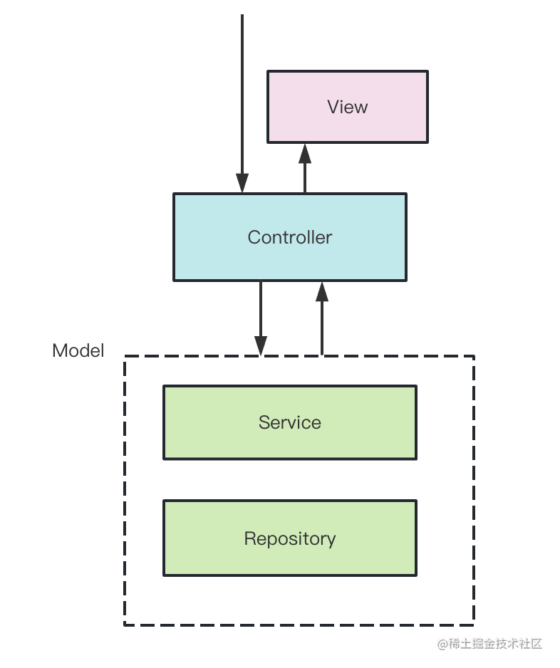
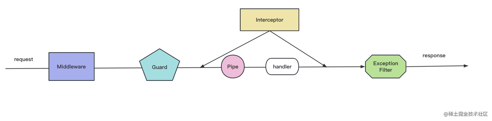

## Nest 基础知识

### Ioc 是啥，解决了什么问题？

首先大概说一下，我所了解到的后端，无非就是一堆对象组成在一起，很很错综复杂的关系，Controller 依赖了 Service 实现业务逻辑，Service 依赖了 Repository 来做增删改查，Repository 依赖 DataSource 来建立连接，DataSource 又需要从 Config 对象拿到用户名密码等信息。

```javascript
const config = new Config({ username: "xxx", password: "xxx" });

const dataSource = new DataSource(config);

const repository = new Repository(dataSource);

const service = new Service(repository);

const controller = new Controller(service);
```

在应用初始化的时候，需要理清依赖的先后关系，创建一大堆对象组合起来，还要保证不要多次 new，是不是很麻烦？没错，这是一个后端系统都有的痛点问题。

IoC 机制是在 class 上标识哪些是可以被注入的，它的依赖是什么，然后从入口开始扫描这些对象和依赖，自动创建和组装对象。

### 全局模块和生命周期

一个模块导出，另一个模块导入，那么如果一个模块被多次导入呢，可不可以把被导入的模块能不能设置成全局的，它导出的 provider 直接可用呢？

其实这个知识点很简单，@Global 这个装饰器就 ok，不过全局模块还是尽量少用，不然注入的很多 provider 都不知道来源，会降低代码的可维护性。

下图描述了关键应用生命周期事件的顺序，从应用启动到节点进程退出。 我们可以将整个生命周期分为三个阶段： **initializing** 、**running** 和 **terminating** 。 使用此生命周期，你可以规划模块和服务的适当初始化、管理活动连接并在收到终止信号时优雅地关闭你的应用。


### AOP 架构

后端框架基本都是 MVC 的架构。

MVC 是 Model View Controller 的简写。MVC 架构下，请求会先发送给 Controller，由它调度 Model 层的 Service 来完成业务逻辑，然后返回对应的 View。



如果想在这个调用链路里加入一些通用逻辑该怎么加呢？比如日志记录、权限控制、异常处理等。容易想到的是直接改造 Controller 层代码，加入这段逻辑。这样可以，但是不优雅，因为这些通用的逻辑侵入到了业务逻辑里面。能不能透明的给这些业务逻辑加上日志、权限等处理呢？那是不是可以在调用 Controller 之前和之后加入一个执行通用逻辑的阶段呢？比如这样：


这样的横向扩展点就叫做切面，这种透明的加入一些切面逻辑的编程方式就叫做 AOP （面向切面编程）。

AOP 的好处是可以把一些通用逻辑分离到切面中，保持业务逻辑的纯粹性，这样切面逻辑可以复用，还可以动态的增删。



### Nest 装饰器

- **@Module： 声明 Nest 模块**
- **@Controller：声明模块里的 controller**
- **@Injectable：声明模块里可以注入的 provider**
- **@Inject：通过 token 手动指定注入的 provider，token 可以是 class 或者 string**
- **@Optional：声明注入的 provider 是可选的，可以为空**
- **@Global：声明全局模块**
- **@Catch：声明 exception filter 处理的 exception 类型**
- **@UseFilters：路由级别使用 exception filter**
- **@UsePipes：路由级别使用 pipe**
- **@UseInterceptors：路由级别使用 interceptor**
- **@SetMetadata：在 class 或者 handler 上添加 metadata**
- **@Get、@Post、@Put、@Delete、@Patch、@Options、@Head：声明 get、post、put、delete、patch、options、head 的请求方式**
- **@Param：取出 url 中的参数，比如 /aaa/:id 中的 id**
- **@Query: 取出 query 部分的参数，比如 /aaa?name=xx 中的 name**
- **@Body：取出请求 body，通过 dto class 来接收**
- **@Headers：取出某个或全部请求头**
- **@Session：取出 session 对象，需要启用 express-session 中间件**
- **@HostParm： 取出 host 里的参数**
- **@Req、@Request：注入 request 对象**
- **@Res、@Response：注入 response 对象，一旦注入了这个 Nest 就不会把返回值作为响应了，除非指定 passthrough 为 true**
- **@Next：注入调用下一个 handler 的 next 方法**
- **@HttpCode： 修改响应的状态码**
- **@Header：修改响应头**
- **@Redirect：指定重定向的 url**
- **@Render：指定渲染用的模版引擎**
