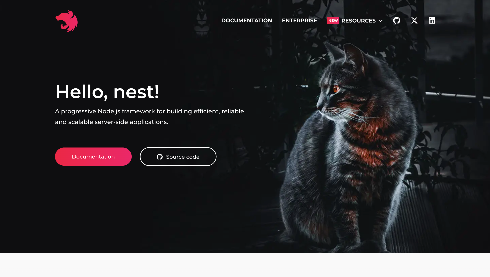
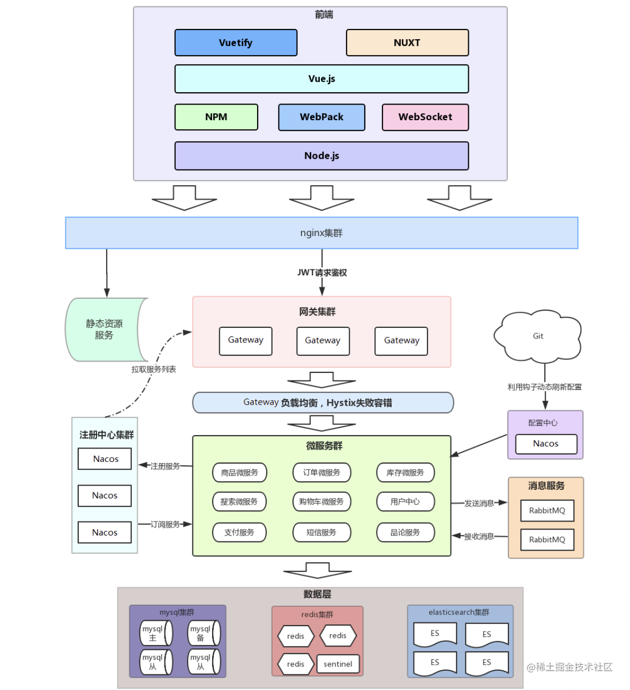

## 邂逅 Nest.js

一直做前端开发，难免有想自己写后端接口的冲动，成为全栈工程师的冲动，我就不信，就写那几个接口，能有多难写，于是，我在多个框架的接触下来，最终选择了 Nest，它是一个非常好的途径，有着 IOC，AOP 等特性。

我觉得我可能会慢慢的认识到更多，接触到我前端接触不到的知识点吧，让我们开始吧开始吧开始吧。

## Node 了解

**开发 node 应用有 3 个层次：**

- **直接用 http、https 包的 createServer api**
- **使用 express、koa 这种处理请求响应的库**
- **使用 nest、egg、midway 这类企业级框架**

我想要学习的，可不仅仅是 Nest，我想把后端的生态，都给学个遍。

## Nest 基础知识

**controller**：控制器，用于处理路由，解析请求参数

**handler**：控制器里处理路由的方法

**service**：实现业务逻辑的地方，比如操作数据库等

**dto**：data transfer object，数据传输对象，用于封装请求体里数据的对象

**module**：模块，包含 controller、service 等，比如用户模块、书籍模块

**entity**：对应数据库表的实体

**ioc**：Inverse of Controller，反转控制或者叫依赖注入，只要声明依赖，运行时 Nest 会自动注入依赖的实例

**aop**：Aspect Oriented Programming 面向切面编程，在多个请求响应流程中可以复用的逻辑，比如日志记录等，具体包含 middleware、interceotor、guard、exception filter、pipe

**nest cli**：创建项目、创建模块、创建 controller、创建 service 等都可以用这个 cli 工具来做

## HTTP 数据传输方式

- **url param**： url 中的参数，Nest 中使用 @Param 来取
- **query**：url 中 ? 后的字符串，Nest 中使用 @Query 来取

* **form urlencoded**： 类似 query 字符串，只不过是放在 body 中。Nest 中使用 @Body 来取，axios 中需要指定 content type 为 `application/x-www-form-urlencoded`，并且对数据用 qs 或者 query-string 库做 url encode
* **json**： json 格式的数据。Nest 中使用 @Body 来取，axios 中不需要单独指定 content type，axios 内部会处理。
* **form data**：通过 ----- 作为 boundary 分隔的数据。主要用于传输文件，Nest 中要使用 FilesInterceptor 来处理其中的 binary 字段，用 @UseInterceptors 来启用，其余字段用 @Body 来取。axios 中需要指定 content type 为 `multipart/form-data`，并且用 FormData 对象来封装传输的内容。
